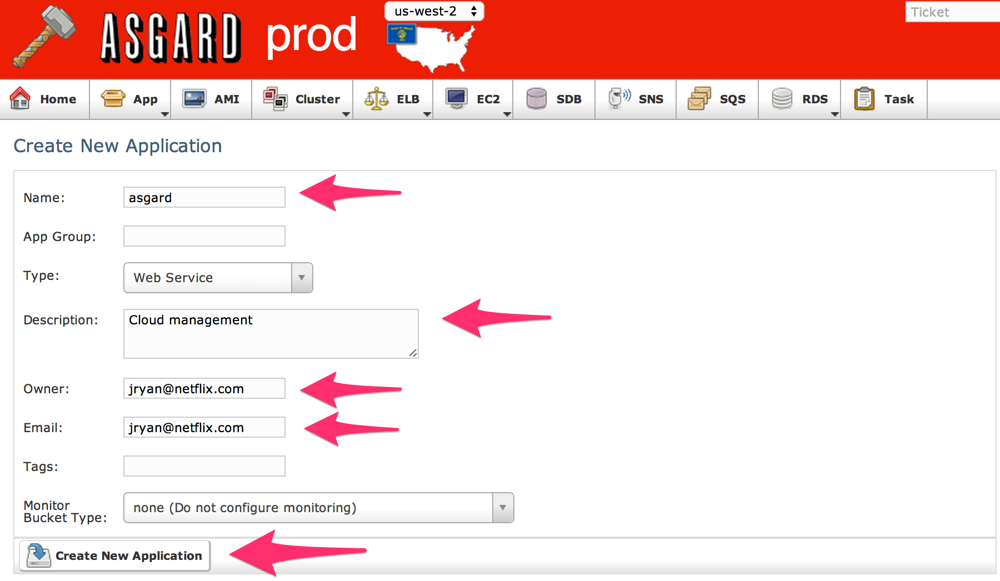

# Step 13 - Stand alone Asgard

To responsibly stand up an instance, we want it in an ASG, with a security group and behind a load balancer. 
In AWS, this also requires a Launch Configuration to define the ASG.
We could stand this up with the <a href="http://aws.amazon.com/cli/" target="_blank">AWS CLI</a> tool or the AWS Console, but it's quite tedious. 
An example is provided at the end of this page.

The general flow for any new application will be to register the Application, create an ELB (if needed), create the first ASG, wait for the first instance to come up, and finally visit it via the DNS Name. 
We're going to run through those steps here for Asgard, but other steps in the tutorial will have you coming back here. 
When they do, follow the "Create Application", "Create an ELB", "Create Auto Scaling Group", and "View instance" parts below, replacing the name "asgard" with the application you're working on. 
Taking note if they require any modifications, they will sometimes use slightly different ports or health check URLs.
Also when re-using this step in the future, the URL for Asgard will be the one you're hosting in an ASG and not localhost.

## Run Asgard

Instead we're going to use Asgard to standup Asgard. 
This will require us to run Asgard on the jumphost for a little while.

    wget https://github.com/Netflix/asgard/releases/download/asgard-1.5/asgard-standalone.jar
    java -DonlyRegions=us-west-2 -Xmx2048m -jar asgard-standalone.jar

## Create Application

In your local browser, navigate to <a href="http://localhost:8080/" target="_blank">http://localhost:8080/</a>. 
You should be viewing us-west-2, if not use the pull down at the top of page to change your region.

1. Navigate to _App | Applications_
2. Click "Create New Application"
3. Enter "asgard" as Name
4. Fill in the _Description_, _Owner_ and _Email_ fields.
5. Click "Create New Application" button. 
6. From the Application screen, click the "Create Security Group" button in the top row of buttons.
7. If you see "vpc…" in the VPC field, make sure to click the checkbox. The other fields should already be filled in.
8. Click "Create New Security Group". It is very likely to get an error message saying _"Could not create Security Group: java.lang.NullPointerException"_. Just click again the button again and you should get another message that says “Security Group 'asgard' already exists.”, which confirms that it was created.
9. After creation you'll be back to the Application screen, click "Edit Security Group" button in the top row of buttons.
10. Check the "Open" checkbox next to elb-http-public
11. Click "Update Security Group"
12. Ensure this new permission is addedto "Ingress Permissions" row.

## Create an ELB

1. Navigate to _ELB | Elastic Load Balancer_
2. Click "Create New Load Balancer"
3. Choose "asgard" as the Application
4. If you created a new VPC, select "Create 'zerotocloud' VPC ELB" under VPC
5. Type (or select) "elb-http-public" in the "Security Group" text box
6. Change "Health Check"’s Healthy Threshold to “5”
7. Click "Create New Load Balancer"
8. It’ll be named "asgard--frontend"

## Create Auto Scaling Group (ASG)

1. Navigate Cluster, via _Cluster | Auto Scaling Groups_
2. Click "Create New Auto Scaling Group"
3. Select "asgard" as the Application
4. Set "Min", “Max” and “Desired Capacity” to 1
5. If you created a new VPC, select "Launch 'zerotocloud' VPC instances" under VPC
6. Type "asgard--frontend" in "Load Balancer" field.  Be sure to select the right load balancer, you won't be able to edit this later.
7. In "AMI Image ID", start to type asgard. Select the baked version of Asgard. When building and baking with unique version numbers, it becomes more obvious which version you're choosing.
8. Ensure "SSH Key" is "zerotocloud"
9. Set "Security Group" to “asgard”
10. Set "IAM Instance Profile" to “jumphost”. When following these instructions for other Applications, they might not use an "IAM Instance Profile" since they don't require a Role.
11. Click "Create New Auto Scaling Group"
12. A Launch Configuration will implicitly be created, and an instance will start booting. Expect a message like "Launch Config 'asgard-20140718181745' has been created. Auto Scaling Group 'asgard' has been created."

Technically an ASG can be heterogenous with regards to the AMI being used. 
Meaning, that a different Launch Configuration can be used in the future, causing some instances to be created with different AMIs. 
This is discouraged at Netflix, because it introduces an unnecessary leve of confusion when looking at an ASG. 
The expectation is that an ASG is homogenous and if a new AMI is needed another ASG is created.

## View instance

1. Navigate to <a href="http://localhost:8080/us-west-2/loadBalancer/show/asgard--frontend" target="_blank">http://localhost:8080/us-west-2/loadBalancer/show/asgard--frontend</a>. Or by going to _ELB | Elastic Load Balancers_ and finding your ELB.
2. Ensure instance is InService under "ELB State". It will start in OutOfService with a description of “Instance registration is still in progress.”. Keep refreshing.
3. Visit the "DNS Name" in your browser, e.g. asgard--frontend-1362846407.us-west-2.elb.amazonaws.com. For all ELBs, this is very relevant, since this is the public URL to access it. It would be recommended in a production environment to create a DNS CNAME to this name.

## End standalone

Once an Asgard instance is running behind an ELB, we no longer need the standalone version running on the jumphost. Ctrl-C out of the _java -jar ..._ process running in your terminal.

## Troubleshooting

If you want to SSH to the instance, visit the application's Security Group in the Console. Then add a rule on the Incoming tab. Specifically you want to select "ssh" from Anywhere to the Asgard security group in the console. 
Then you can run _ssh -i zerotocloud.pem ubuntu@<DNS Name>_. The "DNS Name" is at the top of the instance page.

If the instance never comes up, it could be for a myriad of reasons. 
The most likely is that the AMI was sufficient to start the application, and hence it's not passing it's heathcheck. 
You can use the suggestion above to _ssh_ to the instance to see what it's state is. 
The other common occurance is that the networking isn't right. 
Security Groups are very powerful, but they can be easy to get wrong and hard to diagnose.
Ensure the instance is healthy, then review your Security Group settings.

# AWS CLI

If we had to do this with the aws cli, it would look like this:

    aws ec2 create-security-group --group-name asgard-sg
    aws ec2 authorize-security-group-ingress --group-id sg-123456 --protocol tcp --port 22 --cidr 0.0.0.0/0
    aws elb create-load-balancer --load-balancer-name asgard-lb --listeners Protocol=string,LoadBalancerPort=80,InstanceProtocol=http,InstancePort=7001
    aws autoscaling create-launch-configuration --launch-configuration-name asgard-lc --image-id ami-XXX --key-name zerotocloud --security-groups asgard-sg --instance-type m3.medium --iam-instance-profile jumphost
    aws autoscaling create-auto-scaling-group --auto-scaling-group-name asgard-v000 --launch-configuration-name asgard-lc --min-size 1 --max-size 1 --desired-capacity 1 --availability-zones us-west-2b --load-balancer-names asgard-lb --tags ResourceId=string,ResourceType=string,Key=string,Value=string,PropagateAtLaunch=boolean

You'll notice that the output of one line become the input for the next one.
For example the security group created in the first line is used in the second line.
Since this is a unique name, it is very error prone.
