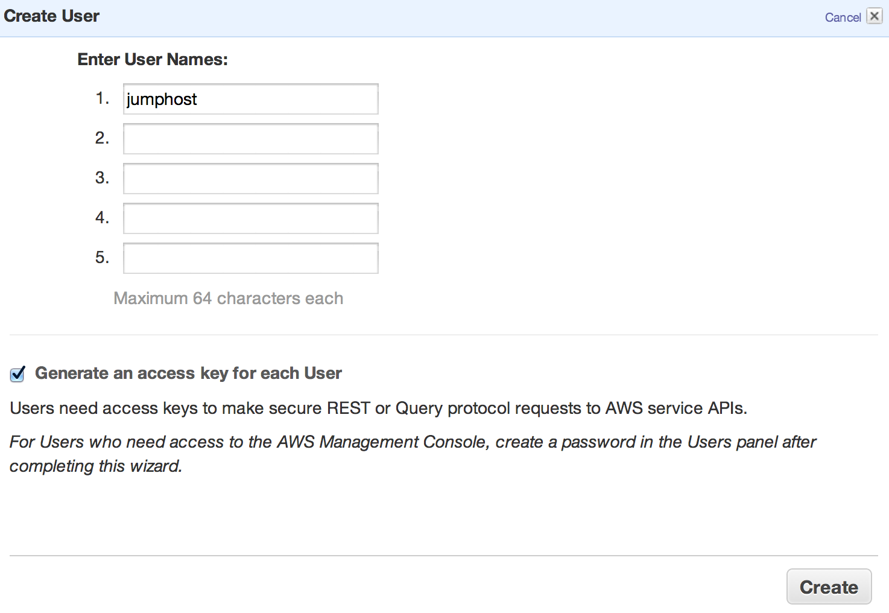
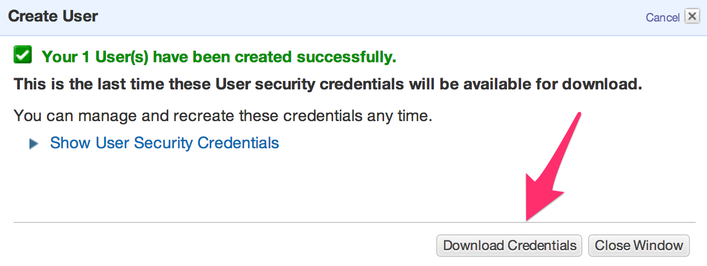
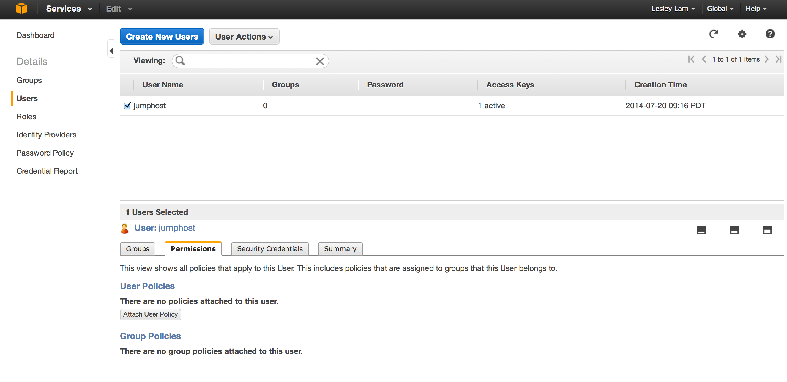
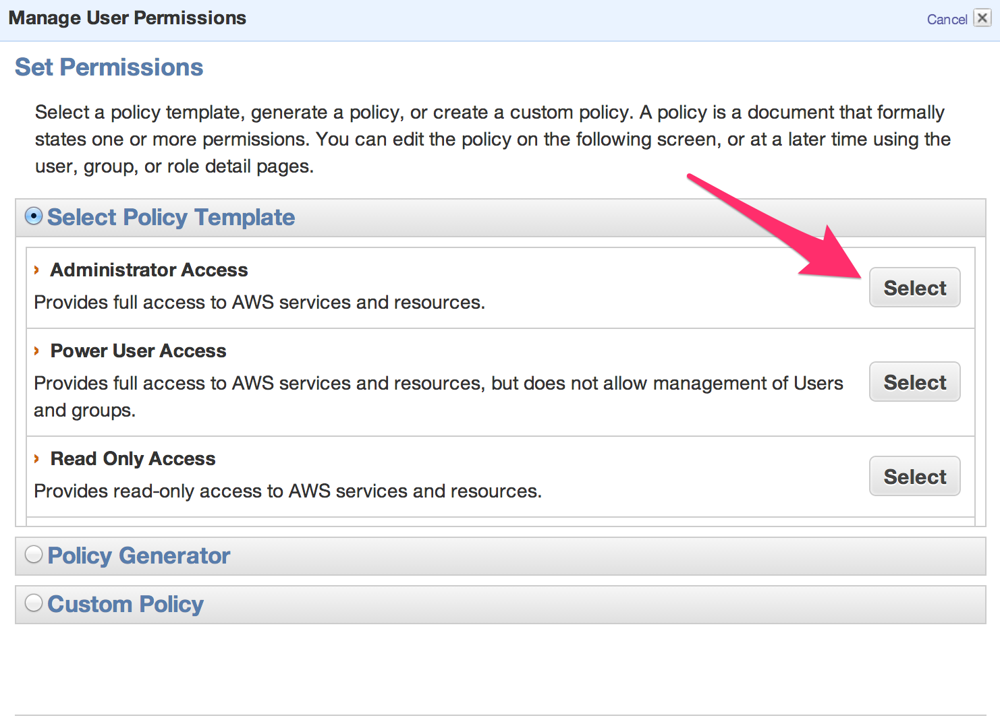
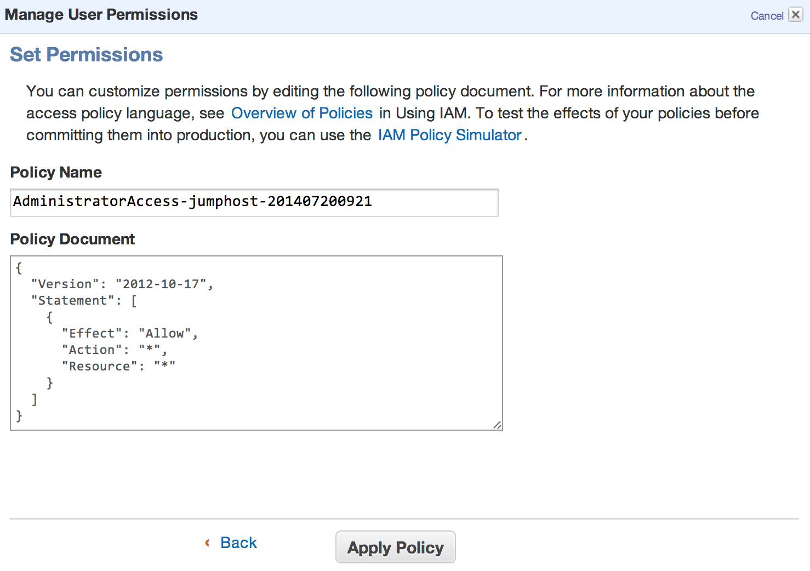

# Step 6 - Create a User

A user is equivalent to a username and password that can be used in API calls to AWS. 
A User is similiar to how the pem files work, but instead of SSH, this is for AWS API calls.
In contrast to a Role, we can use a user anywhere, e.g. our local laptop.

We're creating a user to be stored in a file specifically for our jumphost. That file can be locked down via ACLs and then protected behind _sudo_. If we used a Role on the jumphost, then anyone on the jumphost would have access to it.

1. View <a href="https://console.aws.amazon.com/iam/home?#users" target="_blank">Users</a> page. The page can also be accessed from _Services | IAM | Users_.
2. Select "Create New Users".
3. Enter a single user called jumphost and keep the "Generate an access key for each User" selected. 
4. Click "Create". In the resulting dialog, do not immediately close the window. Click “Download credentials”, then you can close the window. 
5. Select the created jumphost user.
6. Select "Permissions" tab in the lower section. Click “Attach User Policy”. 
7. Select "Administrator Access". (Relatively arbitrary but it’ll work for our tutorial use-cases. Though you should familiarize yourself with a complex set of roles).    
8. Click "Apply Policy". 

