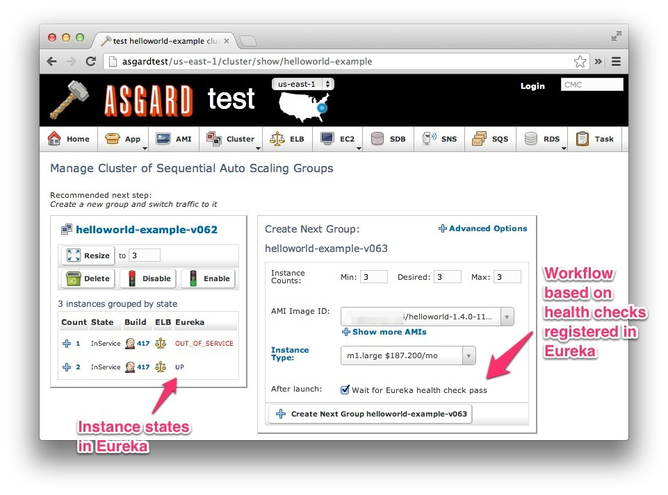
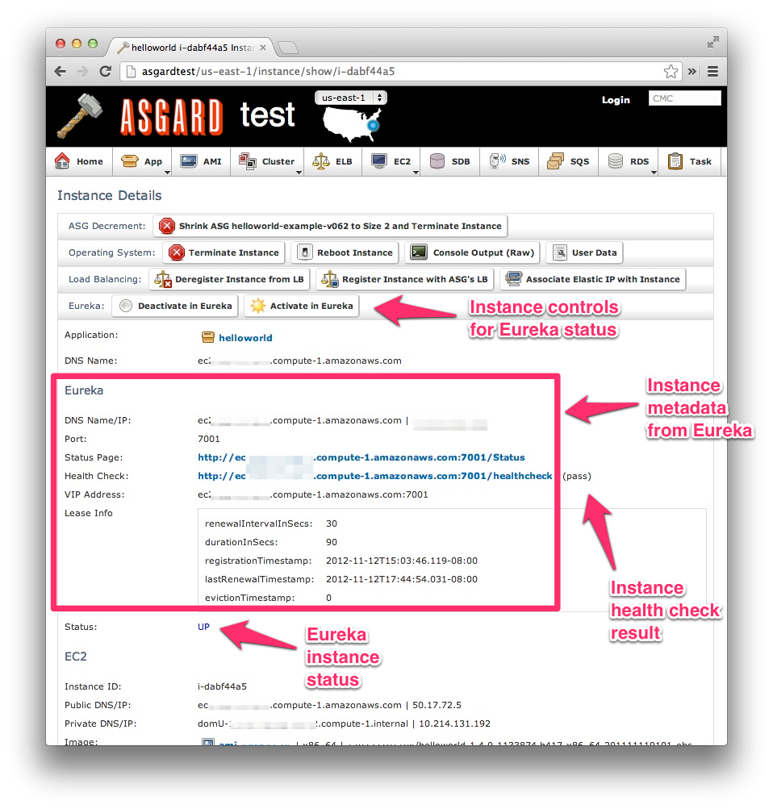

# <a href="https://github.com/Netflix/asgard/wiki/Eureka-Integration" target="_blank">Eureka/Asgard Integration</a>

If Asgard knows about Eureka it will enhance many of the pages with Eureka information. 
The link above goes into more specific of how the integration works.
The following steps are to enable that integregation in a way that is compatible with the rest of this tutorial.

## Build/Bake

If you don't have the eureka--frontend ELB's DNS Name handy, go back to Asgard and find it.
Make sure to use that DNS name below instead of just copying like you have in previous steps.

    EUREKA_ELB=*ELB DNS NAME from Step 15*
    cd ~/zerotocloud
    ./gradlew :asgard:buildDeb
    sudo aminate -e ec2_aptitude_linux -b ubuntu-base-ami-ebs asgard/build/distributions/asgard_1.0.0_all.deb

## Deploy

1. From Asgard, go to _Cluster | Clusters_.
2. Find the Asgard cluster, and select it. The path should look like _/us-west-2/cluster/show/asgard_.
3. There should be a "Create Next Group" box on the right. This is where the next ASG is staged.
3. Select AMI Image Id, select most recently built.
4. Click "Create Next Group asgard-v000". A task page will come up to show the progress of calls to Amazon.
5. Return to the Asgard Cluster page, there is a link at the top and bottom of the page.
6. Click the "Disable" button in the first ASG.
7. Reload the Asgard UI.
8. When visiting a Cluster page, you will now see a Eureka column and a "Wait for Eureka health check pass" checkbox for new clusters.   

FYI, this can not be done as a Rolling Push, since Asgard will disable creation of new instances while killing itself.

