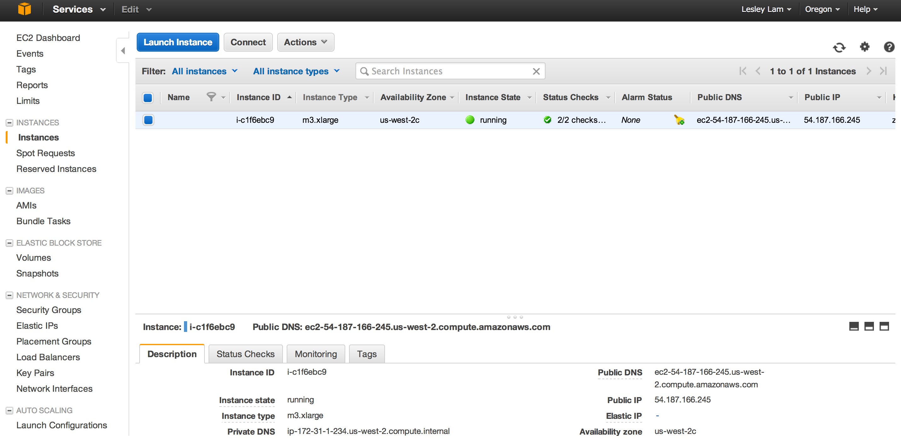
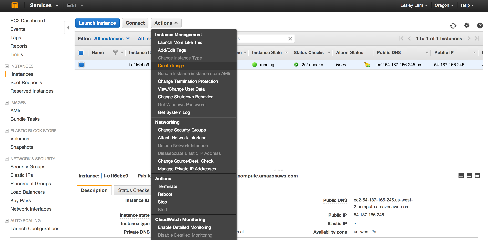
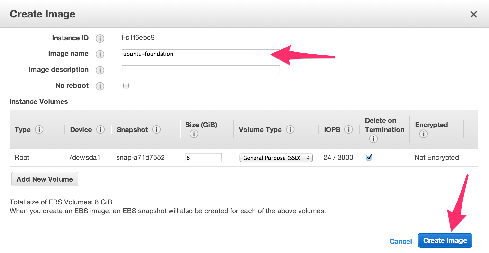

# Step 8 - Foundation AMI

We're going to be constructing our instance's AMIs by "layering" them and this is done baking one on top of the other.
The bottom layer for us is the operating system directly from the vendor.  In this case Ubuntu Trusty from Canonical.
The baking process uses snapshots. As Canonical doesn't provide public snapshots of Ubuntu, we're going to create our own out of the jumphost we created in [Step 4](Jumphost.md).
In this case, we are going to create an image from a running instance. 
An alternative, and how we do it at Netflix, is to take the public AMI from Canonical and _dd_ to volume which can snapshot. 
This gives a snapshot that was never previously started, i.e. there are no remants of previous runs like logs files or lock files.

1. View <a href="https://console.aws.amazon.com/ec2/v2/home?region=us-west-2#Instances:" target="_blank">Instances</a> page. Which can also be accessed from the _Services | EC2 | Instances_. 
2. With your instance selected in [Step 4](Jumphost.md), pull down from the "Actions" menu bar and select “Create Image”. 
3. In the dialog that comes up, Give it an "Image Name" of “ubuntu-foundation” and keep the defaults for the rest of the fields. 
4. Click "Create Image".
5. On following dialog, you can just "Close" it.  
