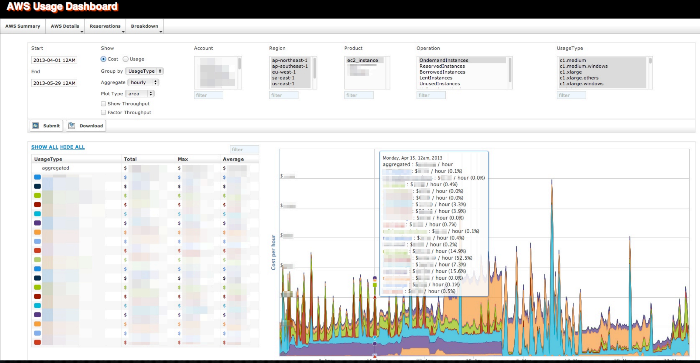

# <a href="https://github.com/Netflix/ice" target="_blank">ICE</a>

Ice provides a birds-eye view of our large and complex cloud landscape from a usage and cost perspective. 

Instructions for settings up ICE are TBD. 

The difficulty in settings up ICE during a tutorial is that the billing reports that ICE needs to process won't be available for a couple of hours.
 
1. Open up two tabs in the AWS console
2. tab1: Enable Billing Reports on [https://console.aws.amazon.com/billing/home?#/preferences](https://console.aws.amazon.com/billing/home?#/preferences)
3. tab2: Create S3 Bucket name to something like zerotocloud.billing [https://console.aws.amazon.com/s3/home?region=us-west-2](https://console.aws.amazon.com/s3/home?region=us-west-2)
4. tab1: enter bucket name (don’t click verify yet),
5. tab1: click sample policy, copy all of the json text to your clipboard.
6. tab2: add bucket policy under bucket permissions
7. tab2: paste json from clipboard and save
8. tab1: verify