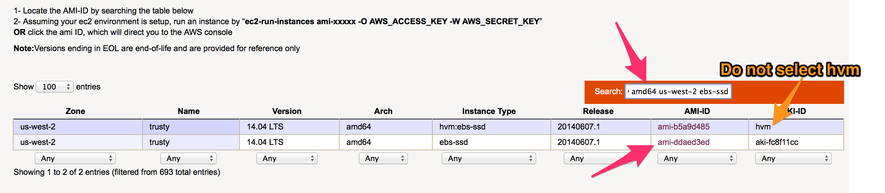
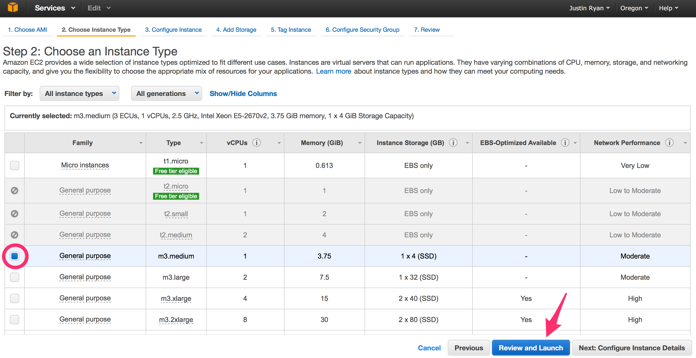
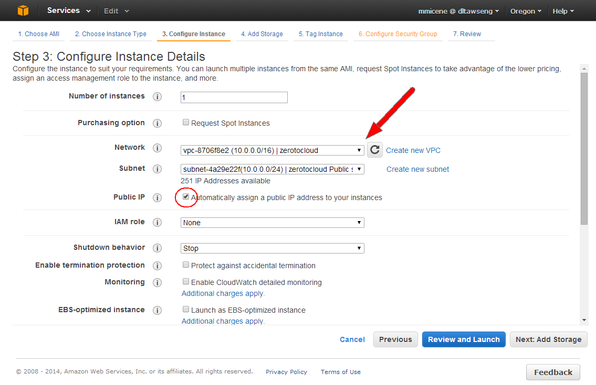
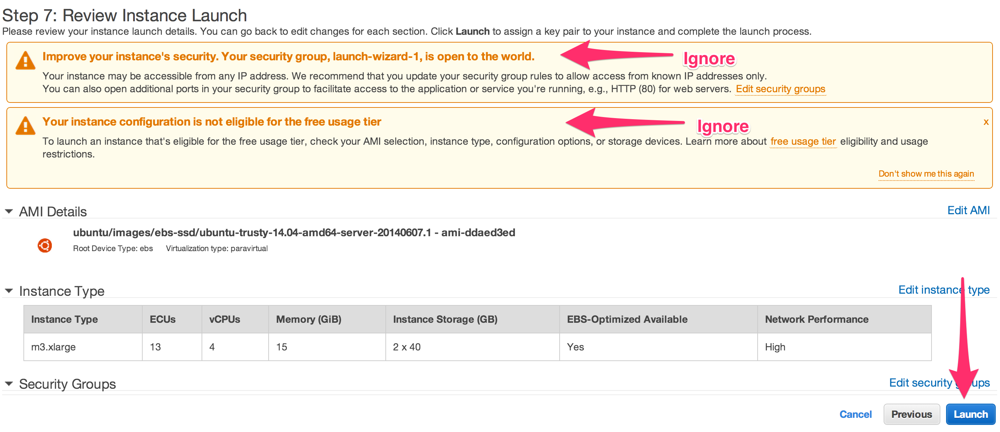
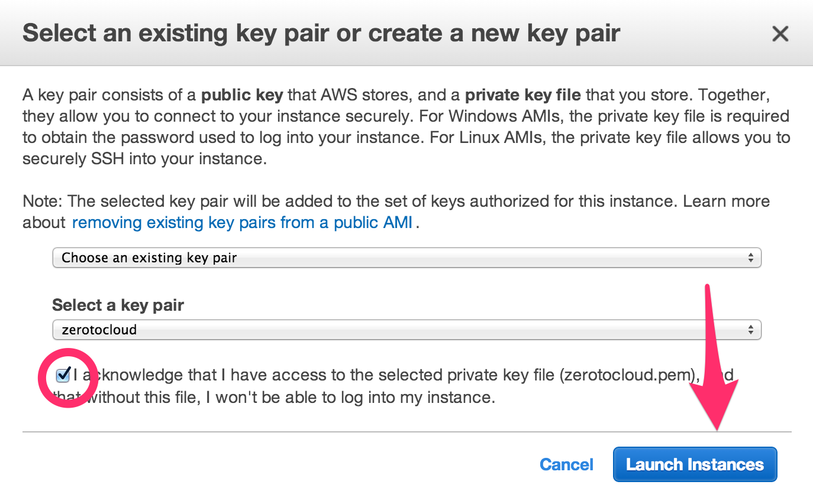
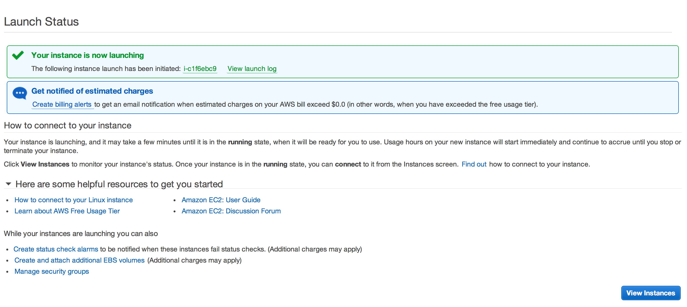

# Step 4 - Create Jumphost

We're creating a "jumphost" for two purposes. 
First to limit the impact of the network during the conference. 
Second, it's how we do things at Netflix (we call it our bastion).
It acts as a choke point to accessing instances in the cloud, since we require people to use it for SSHing to instances (the SSH keys live on this box). 
It has the benefit of being able to track usages and for making changes in a cosolidated area.
In some VPC scenarios where instances do not have public IPs, a jumphost is almost a requirement.

1. Locate your Amazon Machine Image (AMI) at <a href="http://cloud-images.ubuntu.com/locator/ec2/" target="_blank">http://cloud-images.ubuntu.com/locator/ec2/</a>.  On the page's search box, type in "trusty amd64 us-west-2 ebs-ssd" and select the AMI ID.  The AMI ID will look like “[ami-ddaed3ed](https://console.aws.amazon.com/ec2/home?region=us-west-2#launchAmi=ami-ddaed3ed)”. Do not select the HVM version. And ebs version would work, but we are choosing an ssh ebs volume for speed. 
2. Clicking on the AMI ID hyperlink will take you to an AWS page.
3. Select the "m3.xlarge" checkbox. Click “Configure Instance Details”. 
4. Select "zerotocloud" in the Network dropdown list. Click “Public IP” checkbox to ensure you get access from your laptop. Click "Review and Launch".  
5. There will be a warning about Security. This can be changed now or later, in a security group which defaults to something like launch-wizard-1. As a reminder, it’s just SSH and you have the only PEM file. You may also see a message about not being in the free tier.  You can ignore these warnings.  Click Launch. 
6. A dialog will appear to ask about the key pair. Used the one created in Step 3 called zerotocloud. Check the "I acknowledge…" checkbox.  Click “Launch Instances”. 
7. On the following page, there will be a "Your instance is now launching" section.  Immediately after "The following instance launch has been initiated:" is your instance id. Click that link. 
8. The page should show your instance selected. It’ll start in "Pending".  Once started, look in the “Description” tab at the bottom of the page.  On the right hand side, save the value for the for the “Public DNS” field.

# Production

There's a lot that can be done on the jumphost to make it better for day-to-day usage. Here are some suggestions:

* Protect ssh keys so that _sudo_ is required
* Snapshot or bake these instances, for when they go away
* Have multiple jumphosts for redundancy.
