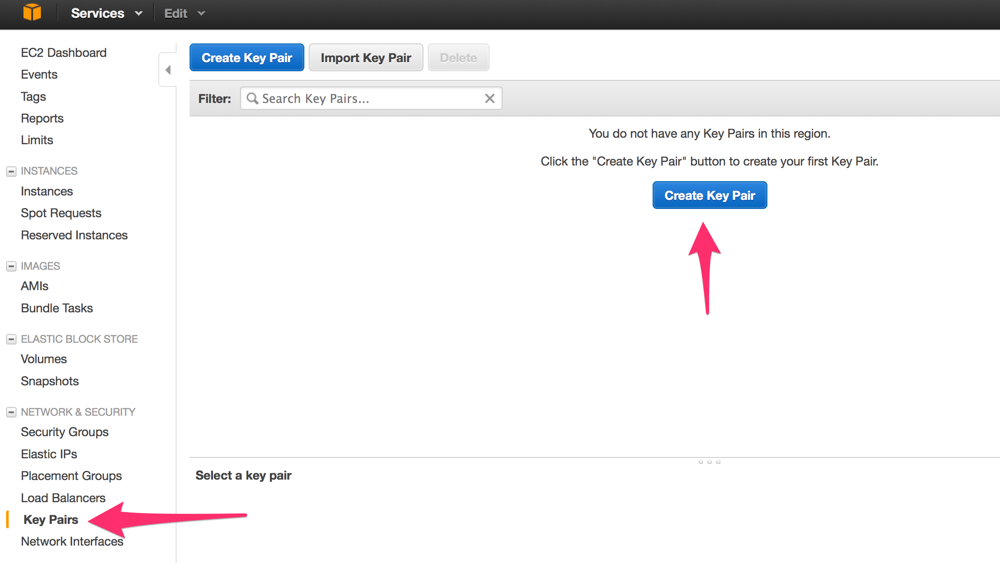
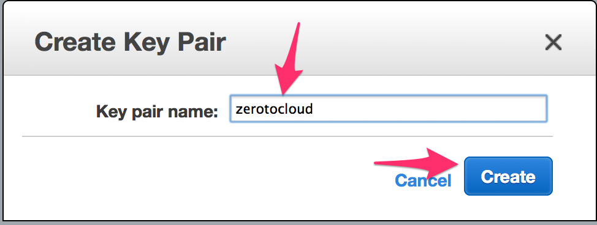
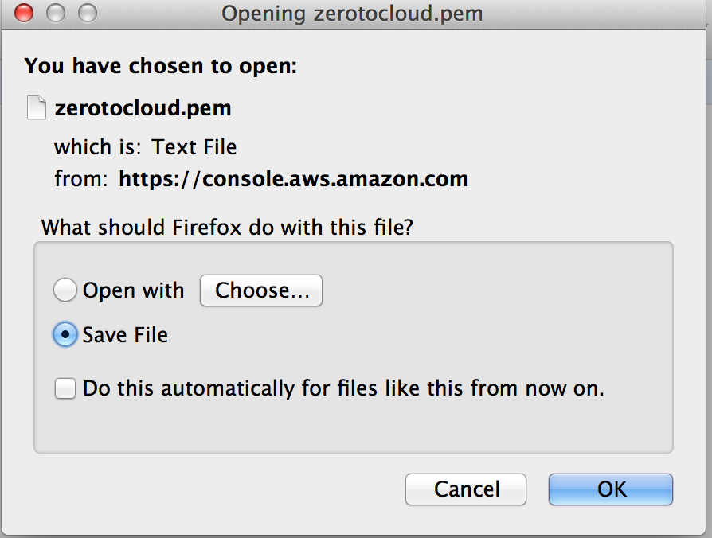

# Step 3 - Key Pair

A keypair is a certificate used for identification in SSH. Amazon has a feature where it will put the public component of a keypair onto an instance during startup. So, as long as you have the private part, and your Security Groups are configured correctly, you can SSH into an instance.

1. Browse to the <a href="https://console.aws.amazon.com/ec2/v2/home?region=us-west-2#KeyPairs:" target="_blank">Key Pairs part of the Console</a>. 
2. Call it "zerotocloud".  
3. It’ll be downloaded to your Downloads directory automatically. If using a non-default Downloads directory, you will have to adjust some later steps. 

