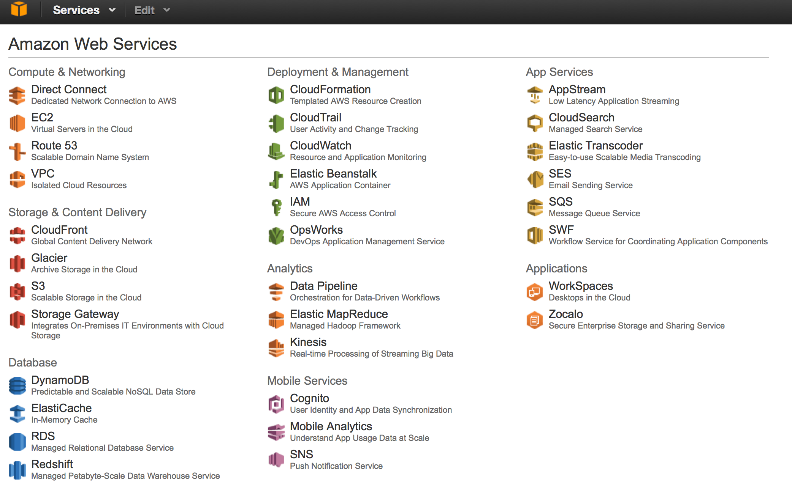

# Step 2 - Log into AWS Console

Let's ensure you can the relevant AWS services.

1. Browse to the [AWS Console](https://console.aws.amazon.com/console/home?region=us-west-2#)
2. . Should see a long listing of Amazon Services.
