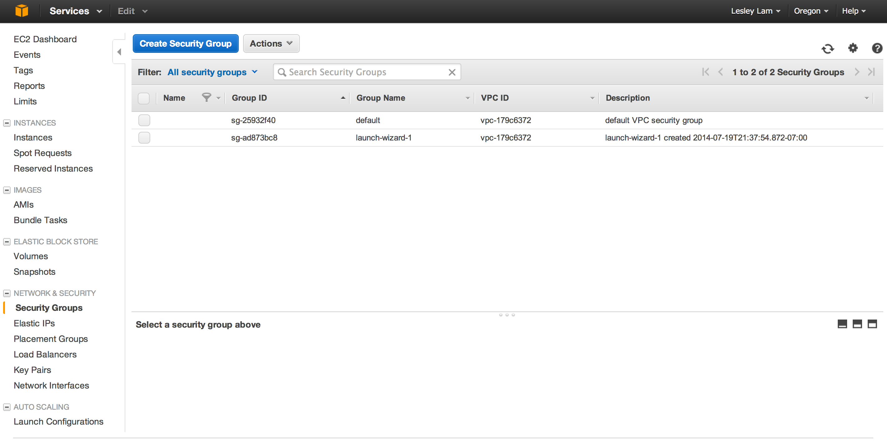
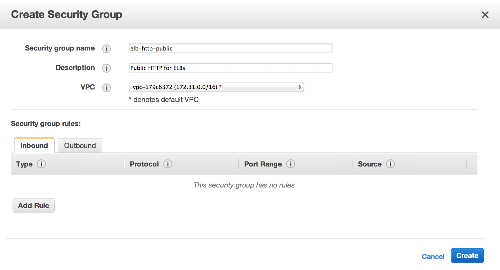
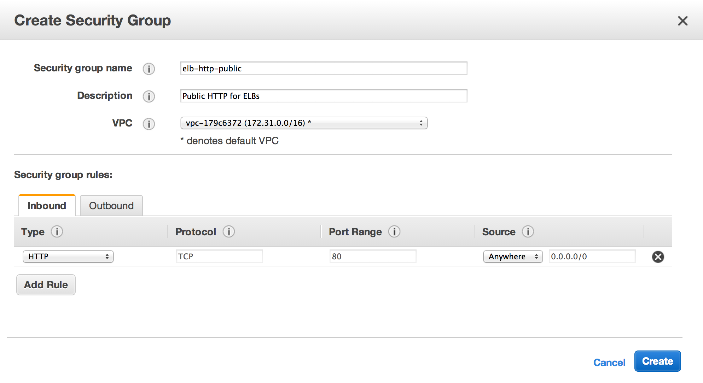
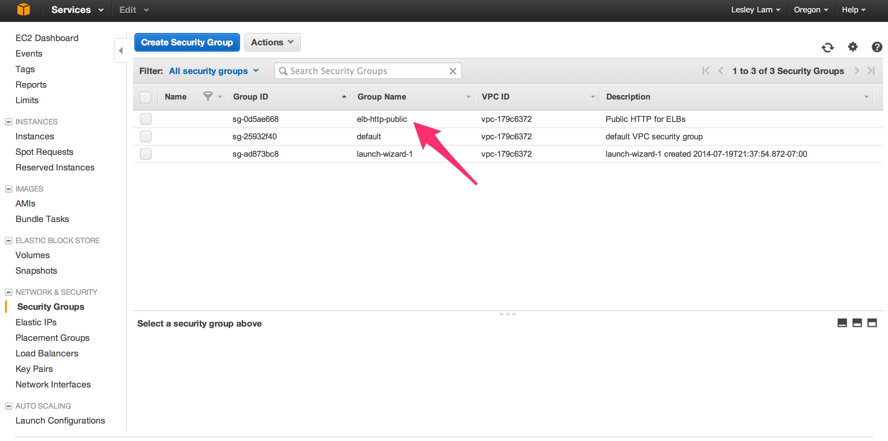

# Step 7 - Create Security Group for ELBs

Security Groups are used for controlling Network access, equivalent to a firewall on each instance but with coordination to make it work like a VLAN.

A general practice at Netflix is to have a security group for each application. This make it easy to grant precise connectivity between applications.
In this tutorial, we're going to be creating our per-application security groups in Asgard. In this step we're creating a security group just for our ELBs, so that they can be accesssed outside of AWS.

1. View <a href="https://console.aws.amazon.com/ec2/v2/home?region=us-west-2#SecurityGroups:" target="_blank">Security Groups</a> page.  Which can also be accessed from the _Services | EC2 | Security Groups_.
2. Click "Create Security Group". 
3. Set "Security group name" to “elb-http-public”.
4. Set "Description" to “Public HTTP for ELBs”.
5. Select the zerotocloud VPC in the "VPC" dropdown. 
6. Click "Add Rule". Select "HTTP" under the Type column. Ensure "Source" shows Anywhere. 
7. Click "Create". 

