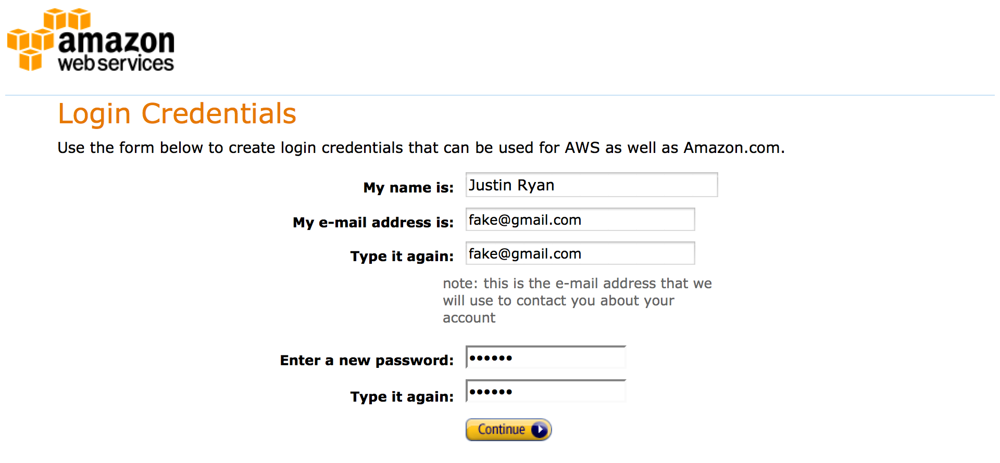

# Step 1 - Sign up for AWS

Navigate to https://portal.aws.amazon.com/gp/aws/developer/registration/. 

* If you see the Billing page, you already have an AWS Account. Nothing else is required.
* If you see the Sign up for AWS page, you have an Amazon account but not a AWS account, skip to number 3.
* Otherwise you'll be prompted to create an Amazon account, start at number 1.

# 1. Sign In To Amazon

# 2. Provide Password and email
 

# 3. Sign up for AWS
![](images/A3_Not_Signed_Up_for_AWS.png]]

# 4. Provide contact details
![](images/A4_AWS_Console_-_Signup.png]]

# 5. Provide Payment Details
![](images/A5_AWS_Console_-_Signup_2.png]]

# 6. Provide Phone Number
![](images/A6_AWS_Console_-_Signup_4.png]]

# 7. Verify Phone Number

Amazon will call your phone to perform it's verification.

![](images/A7_AWS_Console_-_Signup.png]]

# 8. Select Support Plan and Agree to their License
![](images/A8_AWS_Console_-_Signup.png]]

# 9. Welcome!
![](images/A9_Registration_Confirmation.png]]