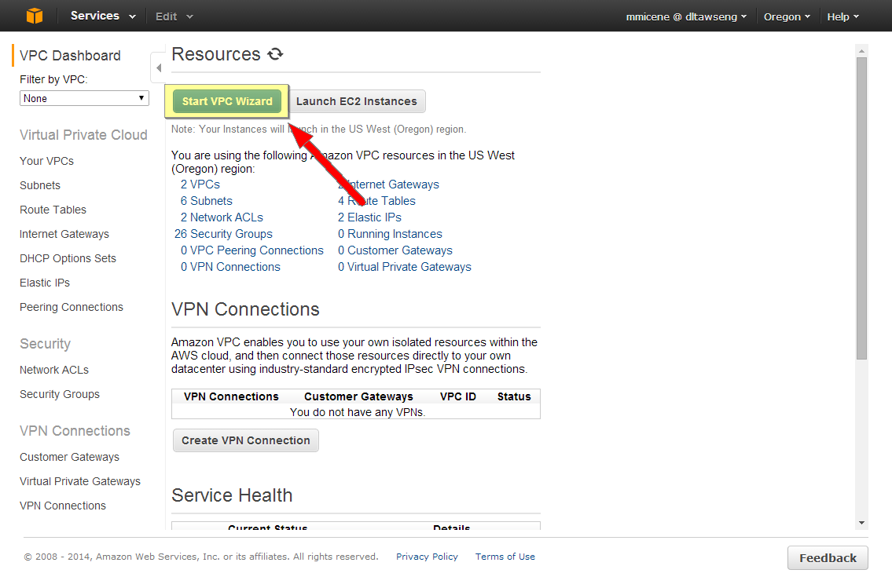
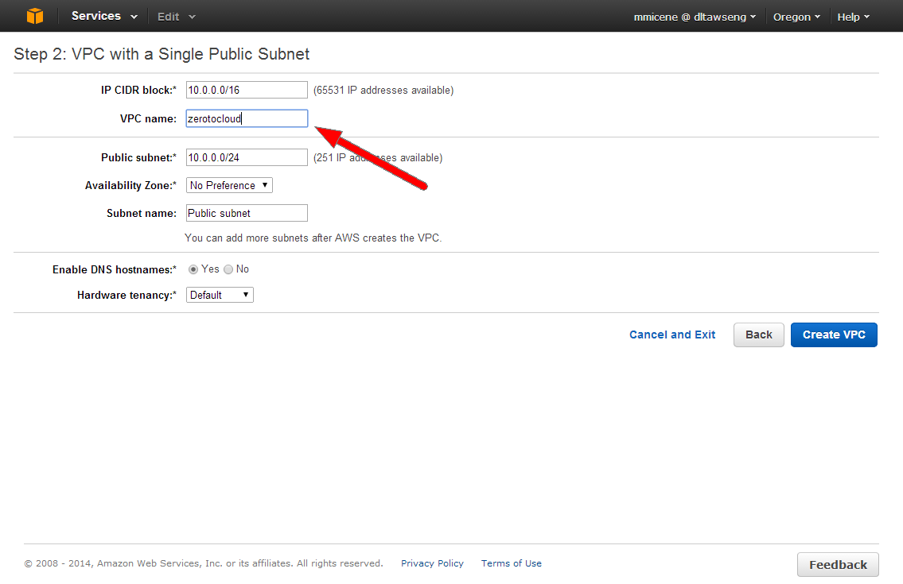
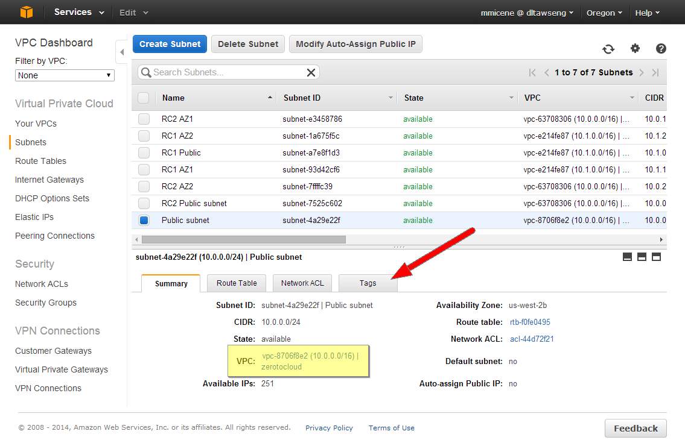
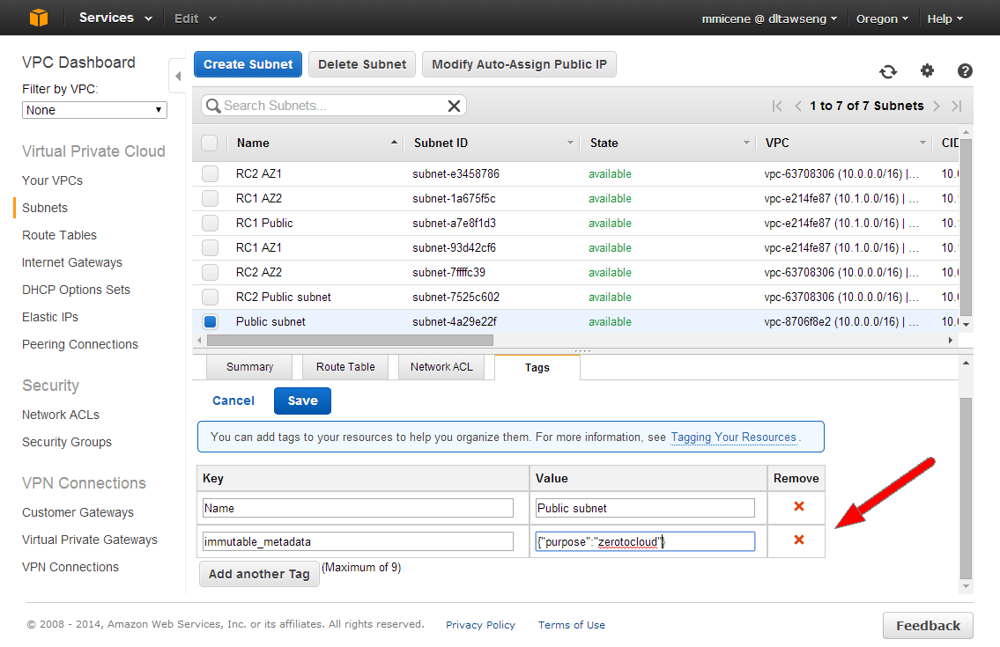
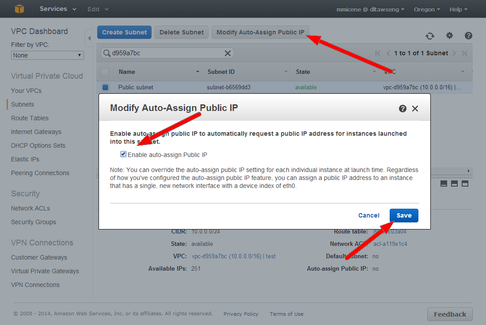

# Step 3 - Create a new VPC (OPTIONAL)

A VPC is a set of isolated resources within the public AWS cloud.  Resources launched here will share specific subnets and other characteristics.  Asgard can support creating resourses in specific VPCs using a set of tags in JSON format.  For more information you can read about VPC Configuration on the <a href="https://github.com/Netflix/asgard/wiki/VPC-Configuration">Asgard wiki.  

1. Browse to the <a href="https://console.aws.amazon.com/vpc/home?region=us-west-2" target="_blank">VPC Dashboard of the AWS Console</a>.
2. Click 'Start VPC Wizard'. 
3. Click 'Select' on Step 1 to create a new VPC with a Public Subnet.
4. Name your VPC 'zerotocloud' and click 'Create VPC' 
5. Click 'OK' on the success screen.  Note the vpc-id of your 'zerotocloud' VPC, we will need this as we move on.  The VPC ID will look like 'vpc-8706f8e2'.
6. Browse to the <a href="https://console.aws.amazon.com/vpc/home?region=us-west-2#subnets:" target="_blank">Subnets section of the VPC Dashboard</a>.  Select the Public subnet that matches the vpc-id of your 'zerotocloud' VPC and click on the 'Tags' tab.
7. Label the subnet with the magic tags, you can also rename your Public subnet here if you like.  The Key is 'immutable_metadata' and the Value is this JSON block '{"purpose":"zerotocloud"}'.  Click 'Save' to create the Tag. 
8. Click 'Modify Auto-Assign Public IP', check the 'Enable auto-assign' checkbox in the popup window and click 'Save'.
